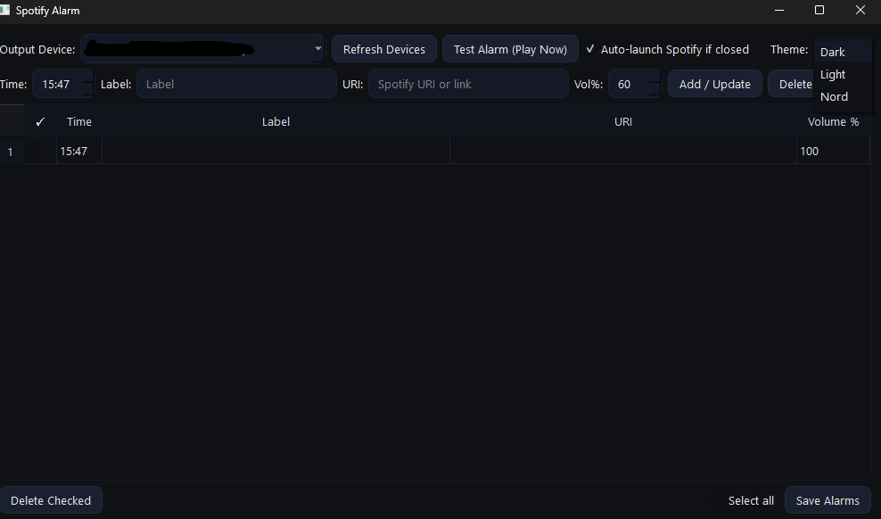

# 🎶 Spotify Alarm

A modern desktop alarm clock that plays **any Spotify playlist, album or track** at scheduled times.

Built with **Python 3.10+**, **PySide6** for the UI, and **Spotipy** for Spotify Web API/OAuth.

 <!-- optional: replace or remove -->

---

## ✨ Features

- Schedule multiple alarms with custom time, label, volume and Spotify URI.
- Automatic Spotify Desktop launch if closed (optional).
- Secure **Spotify OAuth** login – no password storage.
- Configurable default playlist/album/track to play if an alarm has no URI.
- System tray support (minimize to tray, quick test play).
- Windows installer with first-run credentials wizard (creates `config.json` automatically).
- Cross-platform source code: Windows, macOS, Linux.

---

## 🚀 Quick Start (Binary / End-users)

**Windows users** can simply download the latest `SpotifyAlarmSetup.exe` from  
➡️ [Releases](https://github.com/Vasilis92/spotify-alarm/releases)  
and run the installer.

The first run of the installer will ask for:
- **Client ID** and **Client Secret** from the [Spotify Developer Dashboard](https://developer.spotify.com/dashboard).
- An optional default Spotify URI (playlist/album/track).

The app will then appear in your **Start menu** and optionally auto-start on login.

---

## 🛠️ Run from Source (Developers)

Clone the repository and set up a virtual environment:

```bash
git clone https://github.com/YOUR_GITHUB_USERNAME/spotify-alarm.git
cd spotify-alarm
python -m venv .venv
source .venv/bin/activate   # Windows: .venv\Scripts\activate
pip install -r requirements.txt
